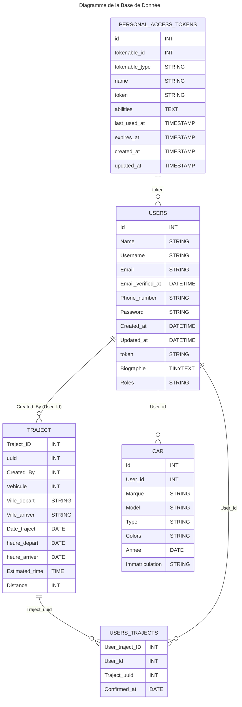

# <h1 align="center" >Vroomeco</h1>

# Installation

- installer php ( v8 )
- installer [Composer](https://getcomposer.org/)
- vérifier que `extension=fileinfo` dans C:\tools\php82\php.ini ( si windows ) est bien décommenté ( enlever le ; )
- pareil pour `extension=pdo_mysql` ( si vous êtes sur Ubuntu, à s'assurer que le driver php_mysql est bien installé )
- même manipulation pour `extension=zip`.
- Lancer le script d'installation dans le dossier vroomeco:
( NOTE: essayez de le lancer à chaque pull d'ailleurs)

### A faire lors d'un clone github : 
```bash
composer install                          | Installe tout les packages laravel 

yarn                                      | Installe tout les packages nodes 
```
Créé le ```.env```  a partire de ```.env.exemple``` 


```
DB_CONNECTION=mysql
DB_HOST=127.0.0.1
DB_PORT=3306
DB_DATABASE=laravel (à modifier)
DB_USERNAME=root
DB_PASSWORD=
```
Puis faire la commande suivante : 
```bash
php artisan migrate     |  Crée le env et migres tout sur la Base de Donner 

php artisan key:generate   | génére une clé d'application 

php artisan serve       |   lance le server laravel 

yarn dev                |  lancer react js (à lancer dans un terminal à part)
```
En production : ```yarn build``` 

En dévelopement : ```yarn dev``` (permet de charger a chaque modification)


### route vers les dossier utiles

| Name | Route | <p align="center">utilisation</p> |
| :--- | ---- | ---: |
| React JS | `/ressource/js` | <p align="center"></p> |
| route front | `/route/web.php` | <p align="center"></p> |
| route back | `/route/api.php` | <p align="center"></p> |
| route Controller | `/app/Http/Controllers` | <p align="center"> A ne pas toucher sauf si vous faite le back</p> |

### Route 

| Route | Description | API |
| ---- | ---- | ---- |
| `/` |  | <p align="center" >❌</p> |
| `/home` |  | <p align="center" >❌</p> |
| `/login` |  | <p align="center" >❌</p> |
| `/register` |  | <p align="center" >❌</p> |
| `/logout` |  | <p align="center" >❌</p> |
| `/trajects` |  | <p align="center" >❌</p> |
| `/aboout-us` |  | <p align="center" >❌</p> |
| `/contact` |  | <p align="center" >❌</p> |
| `/api/roads` | Affiche tous les trajet disponible | <p align="center" >✅</p> |
| `/api/create-roads` | Crée un nouveau traject | <p align="center" >✅</p> |
| `/api/search` | recherche des traject spécific | <p align="center" >✅</p> |
| `/api/roads/{uuid}` | affiche 1 trajet bien spécifique part rapport a son uuid | <p align="center" >✅</p> |

### Ajout des Seeder : 
#### Seeder Utilisateur : 

```bash
    php artisan db:seed --class=UsersTableSeeder
```
Donner rentrer dans la base de donnée 
```php
        DB::table('users')->insert([
            'name' => 'John Doe',
            'username' => 'johndoe',
            'email' => 'johndoe@example.com',
            'phone_number' => '123456789',
            'password' => Hash::make('password'), 
            'biographie' => 'Lorem ipsum dolor sit amet, consectetur adipiscing elit.',
            'created_at' => now(),
            'updated_at' => now(),
        ]);

```
#### Seeder Cars (voiture utilisateur) : 

```bash
    php artisan db:seed --class=CarsSeeder
```

Donner rentrer dans la base de donnée 

```php
        DB::table('cars')->insert([

            [

                'user_id' => 1,

                'marque' => 'Toyota',

                'model' => 'Corolla',

                'type' => 'Sedan',

                'colors' => 'Blue',

                'annee' => '2020-01-01',

                'immatriculation' => 'ABC123',

                'created_at' => now(),

                'updated_at' => now(),

            ],

        ]);
```

### Donner de test API 

#### Cree un nouveau trajet : 
```json
{
    "created_by": "1",
    "vehicule": "1",
	"nombre_place": "3",
    "ville_depart": "Paris",
    "ville_arriver": "Lyon",
    "date_traject": "2024-03-08",
	  "heure_depart": "08:00:00"
}
```

#### Rechercher un trajet : 

```json
{
    "ville_depart": "",
    "ville_arriver": "",
    "date_traject": ""
}
```

#### Diagram de la bdd 


