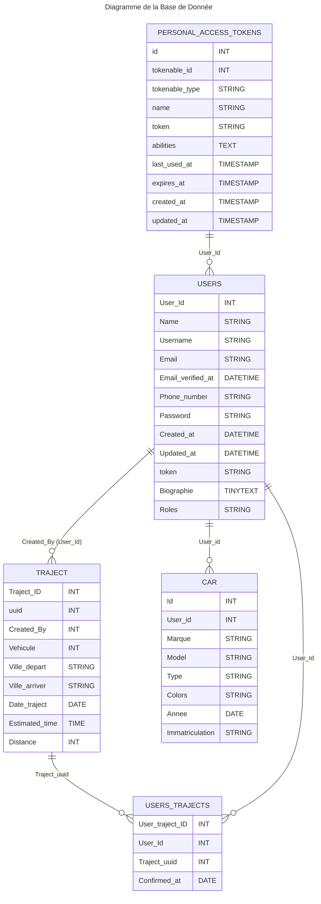

# <p align="center" >Vroomeco</p>

# Installation

- installer php ( v8 )
- installer [Composer](https://getcomposer.org/)
- vérifier que `extension=fileinfo` dans C:\tools\php82\php.ini ( si windows ) est bien décommenté ( enlever le ; )
- pareil pour `extension=pdo_mysql` ( si vous êtes sur Ubuntu, à s'assurer que le driver php_mysql est bien installé )
- même manipulation pour `extension=zip`.
- Lancer le script d'installation dans le dossier vroomeco:
( NOTE: essayez de le lancer à chaque pull d'ailleurs)

### A faire lors d'un clone github : 
```bash
composer install                          | Installe tout les packages laravel 

yarn                                      | Installe tout les packages nodes 
```
Créé le ```.env```  a partire de ```.env.exemple``` 


```
DB_CONNECTION=mysql
DB_HOST=127.0.0.1
DB_PORT=3306
DB_DATABASE=laravel (à modifier)
DB_USERNAME=root
DB_PASSWORD=
```
Puis faire la commande suivante : 
```bash
php artisan migrate     |  Crée le env et migres tout sur la Base de Donner 

php artisan key:generate   | génére une clé d'application 

php artisan serve       |   lance le server laravel 

yarn dev                |  lancer react js (à lancer dans un terminal à part)
```
En production : ```yarn build``` 

En dévelopement : ```yarn dev``` (permet de charger a chaque modification)


### route vers les dossier utiles

<p align="center">Name</p>| Route | <p align="center">utilisation</p>
:----------------|------------- |-------------:
 React JS | `/ressource/js` | <p align="center"></p>
 route front | `/route/web.php` | <p align="center"></p>
 route back | `/route/api.php` | <p align="center"></p>
 route Controller | `/app/Http/Controllers` | <p align="center"> A ne pas toucher sauf si vous faite le back</p>


### Route 

| Route | Description | Api
:---------------- |-------------| -------------:
  `/`| route vers la page d'acceuil     |<p align="center" >❌</p>
  `/home`| route vers la page d'acceuil après authentification     |<p align="center" >❌</p>
  `/login`| route vers la page de login     | <p align="center" >❌</p>
  `/register`| route vers la page de register | <p align="center">❌</p>
  `/logout`| route vers la page de deconnexion     |<p align="center" >❌</p>

#### Donnée par default: 
`A venir ...`

#### Diagram de la bdd 


